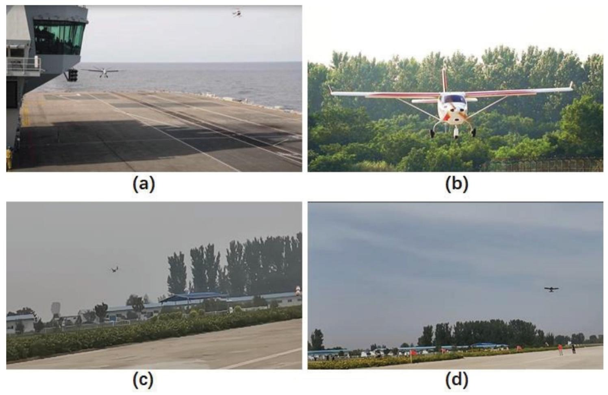
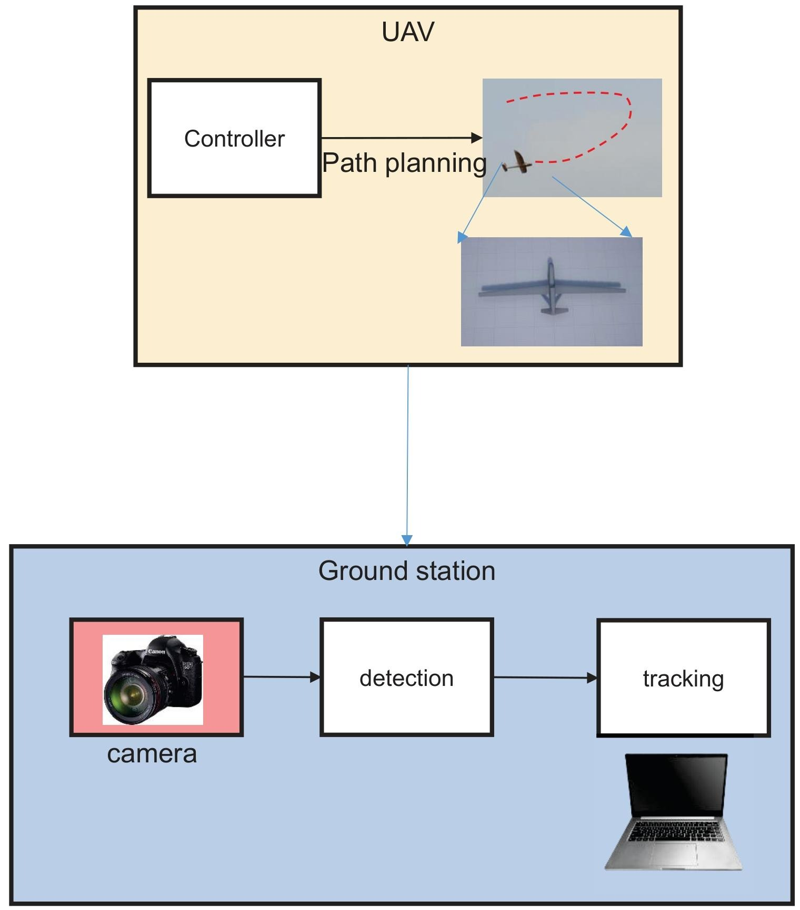
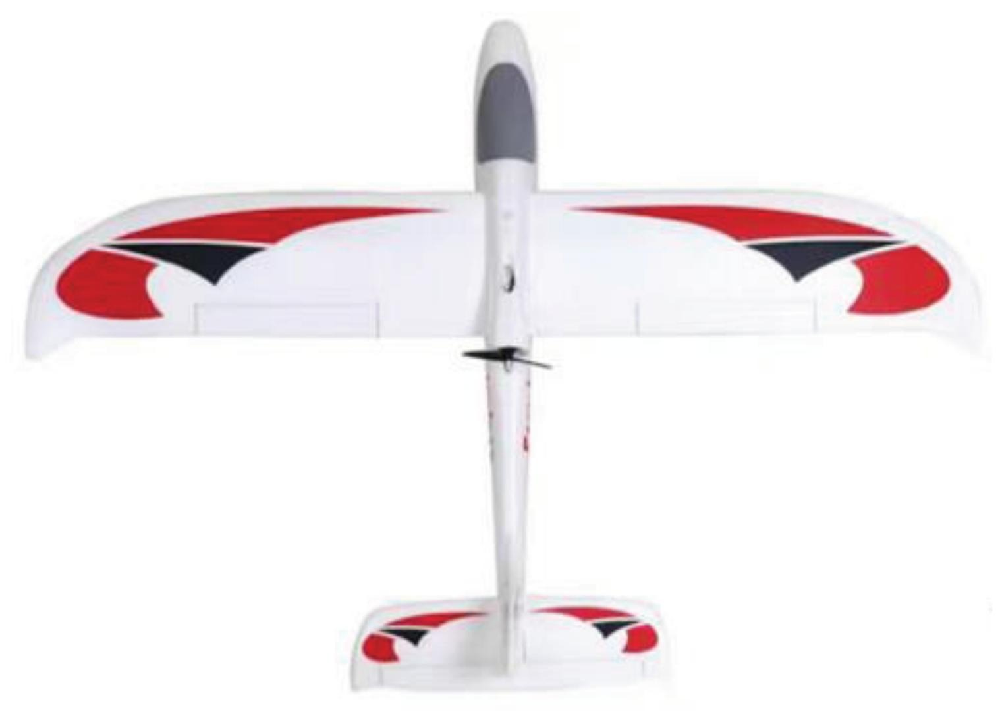
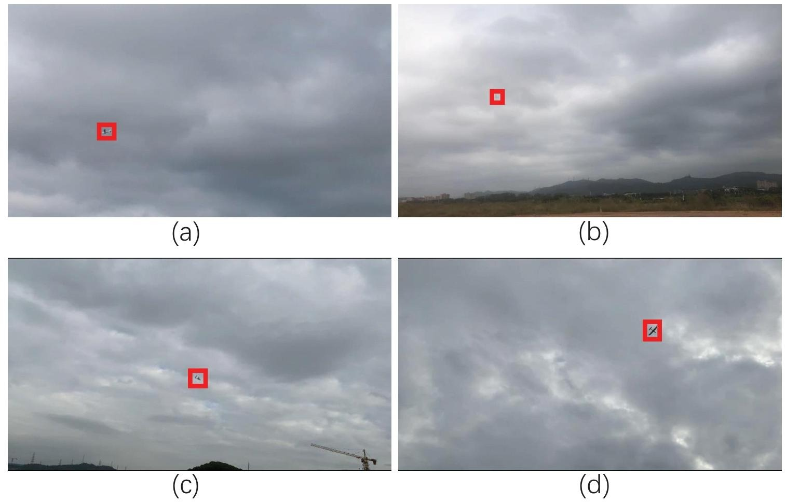
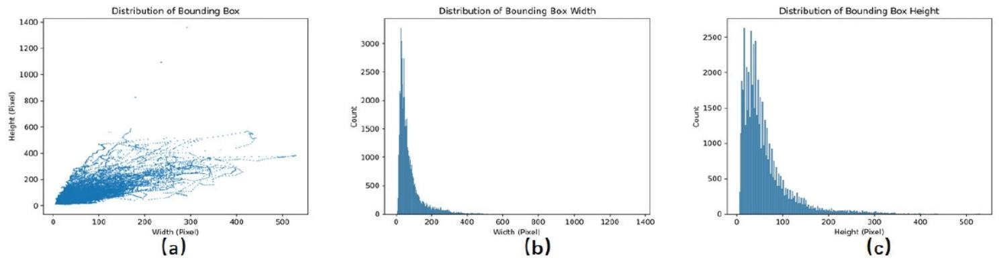
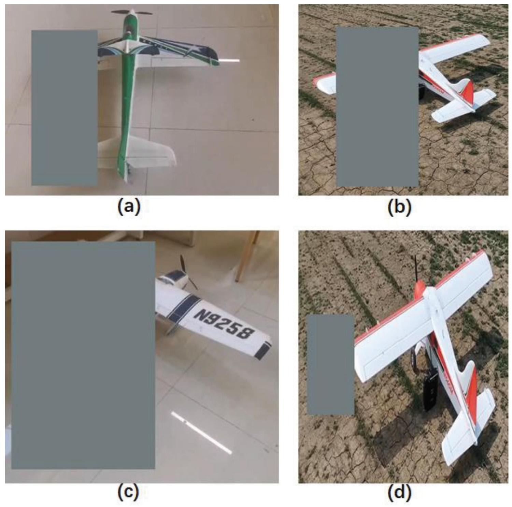
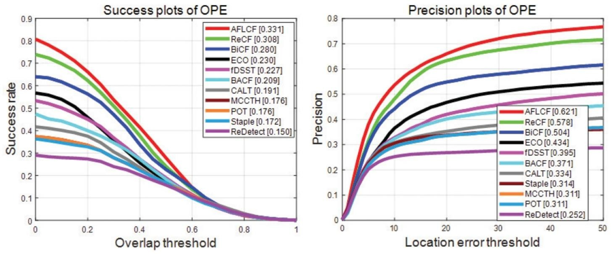
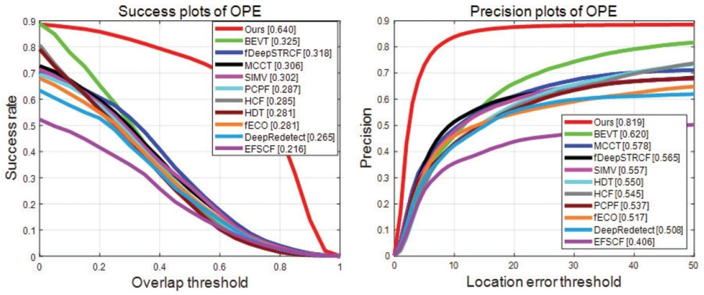
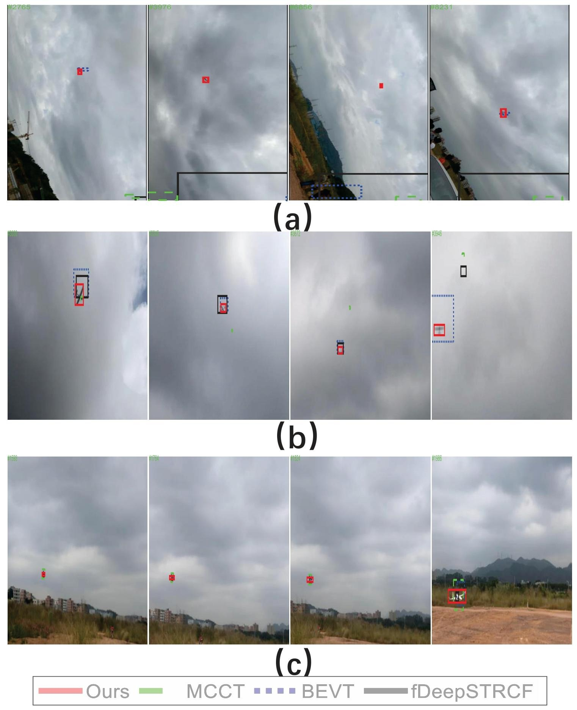

<p align="center">

  <h1 align="center">Ground view fixed-wing UAV tracking dataset and experimental evaluation</h1>


  <p align="center">
    <a href="https://github.com/hapless19" rel="external nofollow noopener" target="_blank"><strong>Yong Wang</strong></a>
    ·
    <a href="https://github.com/liw11111" rel="external nofollow noopener" target="_blank"><strong>Wei Li</strong></a>
    ·
    <a href="" rel="external nofollow noopener" target="_blank"><strong>Xiangyu Zhu</strong></a>
    ·
    <a href="" rel="external nofollow noopener" target="_blank"><strong>Lu Ding*</strong></a>
  </p>
<p align="center">
    <a href="" rel="external nofollow noopener" target="_blank">Unmanned Systems 2026</a>
  <p align="center">
    
  <p align="center">
<p align="center" style="font-size: 18px; color: gray;">
    Fig. 1. Applications of tracking a fixed-wing UAV. (a) a UAV landing on a ship. (b) a UAV landing on airport. (c) a UAV pose estimation. (d) a UAV pose estimation.
</p>
<p align="center">
    
</p>
<p align="center" style="font-size: 18px; color: gray;">
    Fig. 2. Pipeline of the fixed-wing UAV tracking.
</p>

## **Abstract** 📝
We construct a ground view vision system based on a monocular camera and processing equipment to track a small size fixed-wing unmanned aerial vehicle (UAV). The system utilizes the captured video as input and a deep learning-based tracking method to estimate the UAV position. A training algorithm is also developed to enhance the tracking performance. To give a thorough test, we construct a ground view fixed-wing UAV tracking dataset (**GFUAVT**). A deep learning-based method is trained on a training dataset to improve tracking performance. 22 tracking methods (11 hand-crafted methods and 11 deep learning-based methods) are tested on the dataset. A thorough analysis is drawn to illustrate the advantages and weakness of the tracking methods. The evaluation results demonstrate that tracking the UAV is far from being solved. And only a small part of video frames is successfully tracked using top ranking algorithms.

---


## News 📢
- We released the **GFUAVT** codebase!
- Great news! Our paper has been accepted to **Unmanned Systems 2025**! 🏆

---

## Table of Contents 📑
- [Introduction](#introduction)
- [Contributions](#contributions)
- [Experimental Results](#experimental-results)
- [Visualizations](#visualizations)
- [Reproduction](#reproduction)
- [Citation](#citation)

---

## **Introduction** 🌟

**Tracking a fixed-wing UAV** is a more challenge problem. The fast moving and large scale of flying area of the fixed-wing UAV lead to motion blur, scale variations and so on. Moreover, there is lack of a large-scale dataset for the **fixed-wing UAV tracking**.

To address this issue, we propose **GFUAVT**, a ground view fixed-wing UAV tracking dataset:
1. The  dataset consists of 57K frames in real-world situations. 
2. It is high quality dense annotation and high diverse.

Additionally, we designed an effective learning strategy to enhance the tracking algorithm. 📝

---

## **Contributions** ✨

- Constructed  the first ground view fixed-wing UAV tracking dataset (**GFUAVT**). The dataset consists of 57K frames in real-world situations. It is high quality dense annotation and high diverse.
- an effective learning strategy is designed to enhance the tracking algorithm. Data augmentation is employed to train a deep learning-based method and improve the tracking results.
- Validated the effectiveness of our approach through extensive experiments on the benchmark dataset.

---

## **Quick View** 📊
### Dataset Examples
#### The fixed-wing UAV.
<p align="center">
    
</p>

#### Dataset Overview 
<p align="center">
    
</p>
<p align="center" style="font-size: 18px; color: gray;">
    The UAV is denoted in red rectangle box.(a) Tiny object. (b) Motion blur. (c) Out of focus. (d) 3D rotation.
</p>

#### Bounding Box 
<p align="center">
    
</p>
<p align="center" style="font-size: 18px; color: gray;">
    (a) Area distribution of the UAV bounding box. (b) Width distribution of the UAV bounding box. (c) Height distribution of the UAV bounding box.
</p>

#### Illustration of the training images
<p align="center">
  
</p>

## **Experimental Results**🖼️
### Success and precision of the hand-crafted feature-based methods
<p align="center">
    
</p>

### Success and precision of the deep learning-based methods
<p align="center">
    
</p>

### Qualitative results of four methods in three typical difficult challenges
<p align="center">
    
</p>
<p align="center" style="font-size: 18px; color: gray;">
    (a) low resolution. (b) motion blur and rotation. (c) scale variation.
</p>

---

## **Quick Start** 🚀

### Dataset
- **GFUAVT**: [Baidu Drive (mt2h)](https://pan.baidu.com/s/1w59YcuoDV_X7bq23Yo2Tew)  


### Dataset Structure
```

├── GFUAVT                      # GFUAVT dataset
│   ├── anno                    # Annotations (47)
│   │   ├── img001001.txt
│   │   └── ...
│   ├── frames                  #  Images
│   │   ├── img001001
│   │   │   ├── 00000041.jpg
│   │   └── ...

```

---

## **Citation** 📚

If you find **GFUAVT** helpful in your research, please consider citing:
```bibtex
@inproceedings{GFUAVT,
  title={Ground view fixed-wing UAV tracking dataset and experimental evaluation},
  author={Yong Wanga, Wei Lia, Xiangyu Zhua, Lu Dingb},
  booktitle={Unmanned Systems},
  year={2026}
}
```

---
